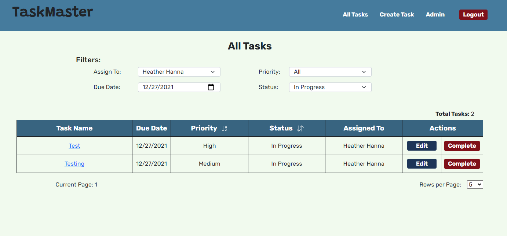

## Table of Contents
* [Background](#Background)
* [Features](#Features)
* [Technologies Used](#Technologies-Used)
* [Functionality](#Functionality)
* [Design and Future Plans](#Design-and-Future-Plans)

___

## Background
At my previous job, part of what I was required to do every day was check on the status of 50-100 shipments. There was a task management system within the proprietary software, but it was slow to load, not intuitive and there were just general flaws with it. I wanted to create a task management system that mirrored that system with improvements! Although I may be biased, I would absolutely prefer to work with my newly created task management system than the one at my former job.

[Return to Table of Contents](#Table-of-Contents)

___

## Features
* General Features
    * Login and Admin User Registration with back-end validations -- a user must be registered by an Admin in order to log in

      

    * View Tasks Dashboard

      

    * Filter tasks based on four different criteria
    * Sort tasks based on priority or status
    * Complete tasks on the table level without leaving the page
    * Table pagination with the ability for users to select how many tasks they'd like to view on a page

      

    * Create a new task and assign it to any other employee if it isn't for the user
    

    * Edit a task --  a user could complete the task here, change the due date and add a new comment, or reassign it to another person
    

    * View a task with comment history from creation and any previous edits
    

* Admin Features  
    * View, create, edit and delete all users
    * Sort users by department
    * Edit users without leaving the page

    
    

[Return to Table of Contents](#Table-of-Contents)
___

## Technologies Used
* React, HTML, CSS, and Bootstrap -- clean, responsive, single page UI
* Express, Node.js, RESTful routing -- execute server code and call on the API to perform CRUD operations
* MongoDB -- one-to-many relationships to allow users to be the creator of a task, and be assigned a task
* JavaScript validations as well as server-side validations and Bcrypt for secure login

[Return to Table of Contents](#Table-of-Contents)

___

## Functionality
Upon loading the web application, the user is prompted to log in. After the user logs in, they are redirected to the task dashboard which by default displays all In Progress tasks assigned to the user that are due that day, at any priority. The user can then adjust the filters as needed to load all the tasks they need to view at that time. They can also adjust the Rows Per Page if they'd rather view more tasks on a single page than flip between pages. From the table, the user can view a task or edit a task on their own pages, and even can complete a task without leaving the view.

If the user chooses to view a task, the web app displays any past comments by whatever user may have edited that task and when they made the edit. This was fairly important at my previous job as the Customer Support Team and Operations Team would need a paper trail of notes to figure out what was going on with that particular order.

If the user chooses to edit a task, the web app displays a task form that lets the user edit all aspects of a task except for who created it, as that should remain static. Once the user edits the task, it will redirect them to the last page they were on.

If the user completes a task on the table, the table will refresh to reflect the change to the task status.

The user can choose to Create a Task in the Nav. This will bring them to the same form as the Edit form, but the status will be hidden as by default when creating a task, it should be "In Progress". From here, the user can create a task and upon submitting the task will be redirected to the last page they were on.

If the user is an Admin, they will be able to view the Admin tab where they can view a table of all employees and sort it based on the department. There is a form on this page that allows the user to create a new employee. If they select edit, the form will change into "edit mode" which will pre-populate the form with that employee's information and hide the password field that the app currently is not able to handle an edit of. The user can also delete any employees from the table without leaving the page, and will cause table to refresh to show the updated information.

All forms have server-side validations.

[Return to Table of Contents](#Table-of-Contents)

___

## Design and Future Plans
I wanted to make this as user friendly as possible for employees. Once the user logs in, they are taken directly to their tasks and are able to able to start sorting and filtering to find the tasks that they need to work on for the day. This is something that I fixed from the task management system I mirrored (with improvements). It would take several clicks to be able to get to your task list, and it would take a very long time for the tasks to load. I really wanted to make this a positive user experience.

I would like to add a feature where an employee receives an email notification any time a task they created has been edited, or they have been assigned a task. This was something that was crucial at my previous job, as people would forget to view their tasks and instead would rely on receiving that email. Along with that, I'd like to add a "forgot my password" feature that would also utilize an email API.

Currently, this is not mobile/tablet friendly. I would like to make version that would be responsive based on screen size since that is extremely important in today's world.

I would also like to look into sockets to allow users to see changes other users make in real time. Currently, there is a lot of unmounting and mounting of components that makes it hardly noticeable if someone were to make a change. However, I like to work in tabs and so if I open a task up in a tab and make a change, it won't reflect on the tasks table without a refresh or a bit of clicking around.
 

[Return to Table of Contents](#Table-of-Contents)
